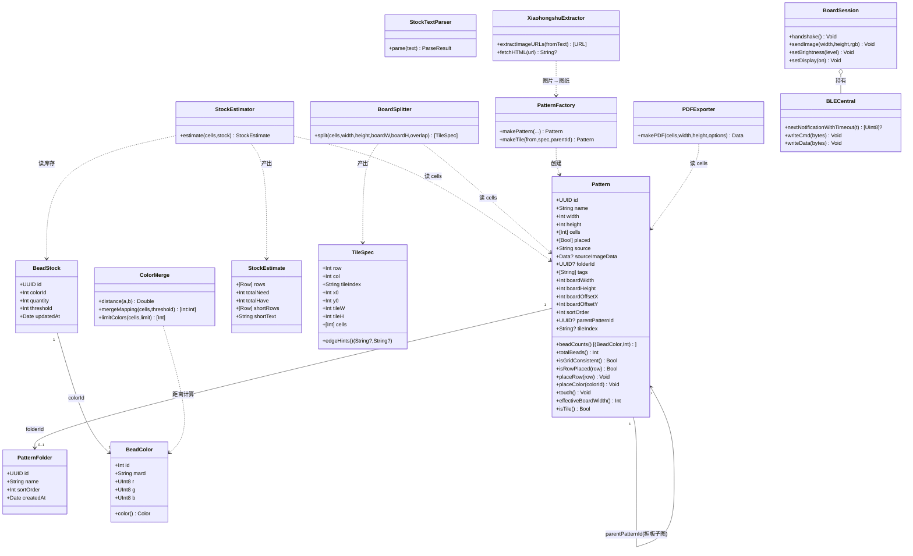
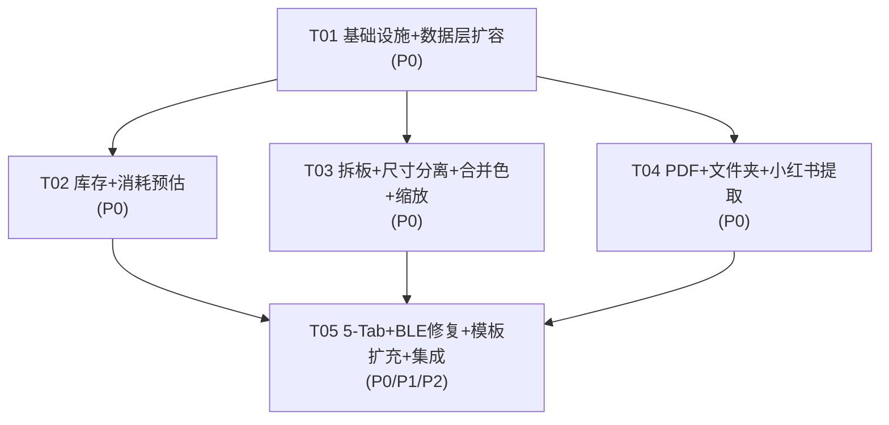

# 豆拼 DouPin — 功能融合 系统架构设计 + 任务分解 v1

> 撰写人：架构师 高见远
> 上游输入：`docs/PRD-功能融合-v1.md`（产品经理 许清楚）+ 主理人代码审查结论（P0-1…P2）
> 目标读者：工程师 寇豆码（按任务列表逐条实现）
> 基线工程：iOS 17+ / SwiftUI / SwiftData / CoreBluetooth，**纯本地、零第三方依赖**，GitHub Actions 云构建未签名 IPA

---

## 0. 阅读指引（先看这个）

本文件分 **Part A 系统设计** 与 **Part B 任务分解**。工程师只需：

1. 先读 §A.1 / §A.2 理解**增量改造原则**与**选型边界**（不改栈、不加依赖、不重写现有能跑的文件）。
2. 按 §B.7 任务列表 **T01 → T02 → T03/T04 → T05** 顺序执行；每完成一个任务必须"能编译"。
3. 遇到约定问题查 §B.8 共享知识（命名/并发/错误/SwiftData 用法）。
4. 新增 Swift 文件**必须同步改 `project.pbxproj`**（§A.3.3 给出逐条指引，手写 plist，不要用二进制合并）。

---

# Part A：系统设计

## A.1 实现方案总览

### A.1.1 一句话方案

在**不重写任何现有文件**的前提下，采用「**新增 Core 服务层 + 新增业务 View + 最小侵入式修改现有 5 个文件**」的增量改造策略，把库存闭环（录入→预估→缺色）、图纸处理链（拆板/尺寸分离/合并相近色/原图对比/多指缩放/PDF/文件夹/小红书链接）与 5-Tab 信息架构一次性补进现有工程。

### A.1.2 三条改造主线

| 主线 | 内容 | 落地方式 |
|------|------|---------|
| **A. 数据层扩容** | `Pattern` 扩展 10 字段 + 新实体 `PatternFolder`/`BeadStock` + `TileSplit` | 扩展现有 `Models.swift` 或新增 `Models+Inventory.swift`；改 `DouPinApp.swift` 的 `ModelContainer` |
| **B. 服务层新增** | 拆板、库存预估、相近色合并、PDF 导出、小红书链接提取、库存文本解析、缩放画布 | **全部新增文件**，放 `Sources/Core/` 与 `Sources/Services/`，不改动已有 Core 文件内部逻辑（除 P0 修复） |
| **C. 交互层重组** | 4 Tab → 5 Tab（首页/图纸/库存/拼豆板/我的）；模板并入图纸；库存 Tab；我的 Tab | 改 `AppRoot.swift`；新增 `InventoryView.swift`/`MoreView.swift`；`TemplateGalleryView` 复用为图纸内嵌页 |

### A.1.3 增量改造原则（硬约束）

1. **零删除**：现有 17 文件全部保留；仅在必要处做**定点修改**（列出见 §A.3.2）。
2. **零新依赖**：一切能力用系统框架实现（PDF→`UIGraphicsPDFRenderer`；链接解析→`URLSession`+正则；缩放→SwiftUI `MagnificationGesture`；文件存储→`FileManager`/SwiftData）。
3. **最小侵入**：新功能优先"新增文件 + 在现有 View 里加一个 NavigationLink/入口"，避免大段重写现有 View（降低把能跑的东西改坏的风险）。
4. **向后兼容**：`Pattern` 新字段全部给默认值，旧数据自动可用；`boardWidth==0` 语义 = "与图纸尺寸相同"。
5. **可编译红线**：每个任务结束都要能 `xcodebuild build` 通过；不允许"半个模块"过夜。

### A.1.4 模块划分（逻辑视图）

```
┌─────────────────────────────────────────────────────────────────────┐
│  App 层          DouPinApp (ModelContainer 扩容)  AppRoot (5 Tab)      │
├─────────────────────────────────────────────────────────────────────┤
│  Views 层  ┌──────────┬────────────┬───────────┬─────────┬──────────┐ │
│            │ 首页      │ 图纸(合并模板)│  库存      │ 拼豆板   │  我的    │ │
│            │ HomeView │ PatternsTab │ Inventory │ Board   │ MoreTab  │ │
│            └──────────┴────────────┴───────────┴─────────┴──────────┘ │
│            WorkDetail · Editor · Convert · SplitBoard · Export · Folder│
├─────────────────────────────────────────────────────────────────────┤
│  Services 层（新增，纯逻辑、无 UI）                                     │
│   BoardSplitter · StockEstimator · StockTextParser ·                  │
│   ColorMerge · PDFExporter · XiaohongshuExtractor · PatternDuplicator │
├─────────────────────────────────────────────────────────────────────┤
│  Core 层（现有，最小扩展）                                              │
│   Models(+扩展) · Palette · PatternRenderer · PixelConverter · Templates│
├─────────────────────────────────────────────────────────────────────┤
│  BLE 层（现有 + P0 修复）  BLEProtocol · BLECentral · BoardSession      │
├─────────────────────────────────────────────────────────────────────┤
│  持久化    SwiftData(本地) + FileManager(原图/导出临时文件) + UserDefaults│
└─────────────────────────────────────────────────────────────────────┘
```

### A.1.5 关键难点与对策

| 难点 | 风险 | 对策 |
|------|------|------|
| **小红书链接提取** | 无公开 API、反爬、合规 | 设计**三级降级**方案（见 §A.5.4），核心是"尽力提取，失败即引导用户手动保存图片/短链解析"，**绝不让主流程依赖它** |
| **拆板边界与非整除** | 90×120 按 29 切 → 末行末列不满 | 算法显式处理 `min()` 截断 + 记录每块真实尺寸（见 §A.5.2） |
| **SwiftData 迁移** | 加字段/实体可能 fail | 全部字段给默认值 + 新实体独立 → 轻量迁移，无 MigrationPlan（见 §A.4.3） |
| **pbxproj 手写** | 漏加引用 → 编译不过 | §A.3.3 给"4 处必改"清单 + ID 命名规则，逐文件执行 |
| **并发（Swift 6 严格）** | UIImage 非 Sendable、@MainActor | §B.8 并发约定：UI/ModelContainer 一律 MainActor；重计算用值类型数组（非 UIImage）传入 detached |
| **BLE 应答错位（P0-2）** | 僵尸 waiter | 用"注册一次性 waiter + 超时移除"替代 withTaskGroup（见 §A.5.5） |

---

## A.2 框架 / 技术选型说明

> **总原则：保持现有栈不动，新能力一律用系统框架。不引入任何 SPM/CocoaPods 依赖。**

| 需求 | 选型 | 理由 |
|------|------|------|
| 数据持久化 | **SwiftData**（现有） | 已在用，新实体直接入 Schema |
| 库存/预估/拆板等纯算法 | **纯 Swift `enum` + `static func`**（无状态） | 与现有 `PatternRenderer`/`PixelConverter` 风格一致，易测 |
| **PDF 导出** | **`UIGraphicsPDFRenderer`**（不是 PDFKit 生成） | PDFKit 擅长**读取/展示**，生成矢量排版用 `UIGraphicsPDFRenderer` 更直接：`beginPage()` 分页、`CGContext` 画网格/文字，与现有 `UIGraphicsImageRenderer` 代码风格同源，一套绘制逻辑可复用。不引入 PDFKit 依赖负担。 |
| **原图对比 / 多指缩放** | **SwiftUI `MagnificationGesture`（或 iOS17 `MagnifyGesture`）+ `ScrollView` 联动** | 系统原语，无需手势库；缩放比例用 `@State scale`，左右两图共享同一 `scale`/`offset` 即可联动 |
| **文件夹** | **SwiftData 新实体 `PatternFolder` + `Pattern.folderId` 弱引用** | 避免 SwiftData 关系（Relationship）的删除级联复杂度；一级文件夹足够 |
| **库存** | **SwiftData 新实体 `BeadStock`（一色号一条）** | 查询/更新 O(1)，比聚合数组简单 |
| **小红书链接解析** | **`URLSession` + `NSRegularExpression` + `URLComponents`**（不引入 SwiftSoup 等 HTML 解析库） | 保持零依赖；用正则从 HTML/分享短链中抠图 URL |
| **文件/大图存储** | **`FileManager`（Application Support）+ SwiftData `Data?`** | 原图压缩 JPEG 长边 ≤2048 存 Data；导出 PDF 写临时文件后 `ShareLink` |
| **设置项** | **`@AppStorage`(UserDefaults)** | 默认板尺寸、引导偏好等轻量配置 |
| **模板素材生成** | **离线生成 `PatternTemplate` 字面量** | "AI 生成原创图案"在**本工程外**完成（用户侧），产物以 `rows: [String]` 形式并入 `Templates.swift`；运行时不联网 |
| 架构模式 | **MVVM-lite**：View + `@Observable`/`ObservableObject` Model + 无状态 `enum` Service | 沿用现有 `EditorModel`/`BoardSession` 的既有模式 |

**明确不使用**：PDFKit 生成、任何 HTML 解析三方库、任何网络 SDK、任何图表库。

---

## A.3 文件清单

### A.3.1 新增文件（15 个）

> 路径相对工程根 `DouPin/`。**每个新增文件都要进 pbxproj**（§A.3.3）。

| # | 文件 | 所属层 | 职责 |
|---|------|--------|------|
| N01 | `Sources/Core/Models+Extensions.swift` | Core | `Pattern` 扩展字段（sourceImageData/folderId/tags/boardW/H/offsetX/Y/sortOrder/parentPatternId/tileIndex）+ board 相关计算属性 + `isGridConsistent` 复用 |
| N02 | `Sources/Core/Models+Inventory.swift` | Core | 新实体 `PatternFolder` / `BeadStock`（可选含 `TileSplit`）；`StockEstimate` 值类型 |
| N03 | `Sources/Services/BoardSplitter.swift` | Service | 拆板算法：`split(pattern:boardW:boardH:overlap)` → `[TileSpec]`；含接缝提示文案生成 |
| N04 | `Sources/Services/StockEstimator.swift` | Service | 消耗预估：`estimate(cells:stock:)` → 三列数据 + 缺色清单 + 复制文本 |
| N05 | `Sources/Services/StockTextParser.swift` | Service | 批量导入宽松解析：`parse(_ text:)` → 成功项 + 失败行号 |
| N06 | `Sources/Services/ColorMerge.swift` | Service | 颜色距离（加权 RGB）+ 合并相近色（阈值）+ 替换整套配色 + 限色候选集修正 |
| N07 | `Sources/Services/PDFExporter.swift` | Service | A4 分页 PDF 生成：`makePDF(cells:...)` → `Data`/临时 URL |
| N08 | `Sources/Services/XiaohongshuExtractor.swift` | Service | 小红书链接/短链/HTML → 图片 URL 提取（三级降级） |
| N09 | `Sources/Services/PatternFactory.swift` | Service | 统一建图纸：从 cells/子图/原图创建 `Pattern`；拆板子图落库；保持"已拼进度为空" |
| N10 | `Sources/Views/InventoryView.swift` | View | 库存 Tab：列表+搜索+色系筛选+缺色高亮+总览；逐条添加/编辑/删除 |
| N11 | `Sources/Views/StockImportView.swift` | View | 批量导入 Sheet：粘贴→解析→冲突处理(累加/覆盖/跳过)→失败行高亮 |
| N12 | `Sources/Views/StockEstimateView.swift` | View | 消耗预估页：三列表格 + 汇总 + 缺色清单 + 复制 |
| N13 | `Sources/Views/SplitBoardView.swift` | View | 拆板设置 + 结果预览（多块缩略 + 拼板布局图 + 接缝提示 + 保存子图） |
| N14 | `Sources/Views/FolderViews.swift` | View | 文件夹列表/新建/重命名/删除；文件夹内图纸列表 + 文件夹内直接上传入口 |
| N15 | `Sources/Views/MoreView.swift` | View | 我的 Tab：默认板尺寸、引导偏好、存储清理、关于 |
| N16 | `Sources/Views/PatternsTabView.swift` | View | 图纸 Tab 容器：分段（全部/文件夹/标签/模板）；模板复用 `TemplateGalleryView` |
| N17 | `Sources/Views/ZoomableGrid.swift` | View | 可复用多指缩放网格（预览用）+ 原图对比容器（左右联动） |

> 共 17 个新增文件（编号至 N17）。数量偏多但**每个文件职责单一、互不返工**；任务分解时按模块打包（§B.7），不会出现"一文件一任务"。

### A.3.2 修改文件（7 个，均为定点修改）

| # | 文件 | 改动点（精确到位置） | 对应需求/缺陷 |
|---|------|---------------------|--------------|
| M01 | `Sources/App/DouPinApp.swift` | `ModelContainer(for: Pattern.self)` → `ModelContainer(for: Pattern.self, PatternFolder.self, BeadStock.self)`；`AppState` 可加 `@AppStorage` 默认板尺寸 | 新实体入 Schema |
| M02 | `Sources/App/AppRoot.swift` | `TabView` 4 → 5：首页/图纸(`PatternsTabView`)/库存(`InventoryView`)/拼豆板/我的(`MoreView`)；模板 Tab 移除；`HomeView` 增库存概览入口 | 5 Tab 决策 |
| M03 | `Sources/Core/Models.swift` | **保留** `isGridConsistent`(已被主理人加)、`isRowPlaced` 的 `hasBead` 守卫（已修）。补：`mirrorHorizontally` 后 `status` 回退（P2）；`placeRow`/`isRowPlaced` 越界防御（P0-1 方向确认） | P0-1/P0-3/P2 |
| M04 | `Sources/Core/PixelConverter.swift` | `candidates(for:)`（P1-1）：`colorLimit=32/64` 走"用量最少色合并到 limit"而非全色 `default`；`limitColors` 补 DTO 化（不传 UIImage） | P1-1 |
| M05 | `Sources/BLE/BLECentral.swift` | `nextNotificationWithTimeout` 重写（P0-2）；删 `didDiscover` 死代码 `(… ? [] : []) + …`（P1-4）；`log` 的 `DateFormatter` 静态化（P2） | P0-2/P1-4/P2 |
| M06 | `Sources/BLE/BoardSession.swift` | `sendImage` 的 StartStream CRC 语义澄清（P0-5，见 §A.5.5，改传 `crc32c(payload)` 或注释锁定单一语义） | P0-5 |
| M07 | `Sources/Views/EditorView.swift` | 第 82 行 `Button("确定") {}` 空闭包补实现（P0-4）；接入原图对比/框选/合并配色/缩放入口；改名后写回并 `touch()` | P0-4 + 图纸处理增强 |
| M08 | `Sources/Views/ConvertView.swift` | `convert()` 去掉 `Task.detached` 传 UIImage（P1-2）；保存原图 `sourceImageData`（长边≤2048 JPEG）；增加"图纸尺寸 / 板尺寸+偏移"两步设置 | P1-2 + 尺寸分离 |
| M09 | `Sources/Views/WorkDetailView.swift` | 菜单增：拆板、消耗预估、导出 PDF、移动文件夹、打标签；`Mode` 增 `estimate` 段；重命名已正确（保持） | 图纸处理入口 |
| M10 | `Sources/Views/BoardTabView.swift` | `onAppear` 的 `displayOn = true` 改为**连接后主动发指令同步**（P1-3） | P1-3 |
| M11 | `Sources/Core/Templates.swift` | 模板 15 → 50+（追加原创 `PatternTemplate` 字面量，分组套装） | 模板扩充 |
| M12 | `DouPin.xcodeproj/project.pbxproj` | 新增 17 文件的 4 处引用（§A.3.3） | 构建 |

> 修改文件共 12 项（编号 M01–M12），其中 M12 为工程文件。真正"改代码逻辑"的仅 M03/M04/M05/M06 四处（+1 行级 P0 修复），其余是"加入口/加字段"，侵入性极低。

### A.3.3 `project.pbxproj` 精确修改指引（手写 plist）

> 该文件是 **XML plist**（非二进制）。新增每个 Swift 文件需要 **4 处**改动。ID 用固定前缀保证唯一：
> `F…` = PBXFileReference，`B…` = PBXBuildFile。现有已用到 `F…01`–`F…17` / `B…01`–`B…17`，**新文件从 `F00000000000000000000018` 起递增**（同理 `B…18` 起）。

**① PBXFileReference（在 `<key>objects</key>` 的 `<dict>` 内，紧随 `F…17` 之后追加）：**
```xml
<key>F00000000000000000000018</key>
<dict>
    <key>isa</key><string>PBXFileReference</string>
    <key>lastKnownFileType</key><string>sourcecode.swift</string>
    <key>path</key><string>Models+Extensions.swift</string>
    <key>sourceTree</key><string>&lt;group&gt;</string>
</dict>
<!-- 依此类推：F…19 = Models+Inventory.swift, … 每个新文件一条 -->
```
> ⚠️ `path` **只写文件名**（如 `BoardSplitter.swift`），因为所属 PBXGroup 已带 `path = Sources/Core` 等前缀。

**② PBXBuildFile（紧随 `B…17` 之后追加，fileRef 指向对应 F 键）：**
```xml
<key>B00000000000000000000018</key>
<dict>
    <key>isa</key><string>PBXBuildFile</string>
    <key>fileRef</key><string>F00000000000000000000018</string>
</dict>
```

**③ PBXGroup（把 F 键加入对应分组 `children` 数组）：**
- `A00000000000000000000018` = `Sources/Core` 组 → 放 `Models+Extensions.swift`、`Models+Inventory.swift`
- `A00000000000000000000019` = `Sources/Views` 组 → 放所有新增 View
- **新增两个组**（`Sources/Services` 目录）：
```xml
<key>A00000000000000000000020</key>
<dict>
    <key>isa</key><string>PBXGroup</string>
    <key>children</key>
    <array>
        <string>F00000000000000000000021</string>  <!-- BoardSplitter.swift -->
        <!-- …其余 Service 文件 F 键… -->
    </array>
    <key>path</key><string>Services</string>
    <key>sourceTree</key><string>&lt;group&gt;</string>
</dict>
```
  并把 `A…20` 追加进 `Sources` 组（`A00000000000000000000015`）的 `children` 数组。

**④ PBXSourcesBuildPhase（关键：把每个 `B…` 键加进编译源列表）：**
在 `A00000000000000000000006`（`PBXSourcesBuildPhase`）的 `files` 数组内，紧随 `B…17` 后追加：
```xml
<string>B00000000000000000000018</string>
<!-- …每个新文件一个 B 键… -->
```
> ❗**漏加第 ④ 步 = 文件不进编译 = 符号找不到**。这是最常见的错误，务必逐一对齐"B 键数量 == Sources 目录下 .swift 数量"。

**校验方法（改完立即验证）：**
1. `F` 键数、`B` 键数、`PBXSourcesBuildPhase.files` 数组元素数 **三者必须相等**（当前基线 = 17）。
2. GitHub Actions 日志第一行 `xcodebuild -list` 能列出 target = plist 语法正确。
3. 本地/CI 若报 `cannot find 'XxxService' in scope` → 99% 是第 ④ 步漏了该文件的 `B` 键。

---

## A.4 数据模型设计

### A.4.1 `Pattern` 扩展字段（新增，全部带默认值）

| 字段 | 类型 | 默认 | 用途 |
|------|------|------|------|
| `sourceImageData` | `Data?` | `nil` | 照片转图纸的**原图**（JPEG，长边 ≤2048），支持原图对比 |
| `folderId` | `UUID?` | `nil` | 所属文件夹（弱引用，不用 SwiftData relationship） |
| `tags` | `[String]` | `[]` | 标签（P1） |
| `boardWidth` | `Int` | `0` | 实际拼板宽；**0 视为等于 `width`** |
| `boardHeight` | `Int` | `0` | 实际拼板高；**0 视为等于 `height`** |
| `boardOffsetX` | `Int` | `0` | 图纸在板上的水平偏移 |
| `boardOffsetY` | `Int` | `0` | 图纸在板上的垂直偏移 |
| `sortOrder` | `Int` | `0` | 手动排序序号 |
| `parentPatternId` | `UUID?` | `nil` | 拆板子图指向父图 |
| `tileIndex` | `String?` | `nil` | 拆板编号（如 `"R1C2"`） |

新增计算属性（放 `Models+Extensions.swift`，不改 `Models.swift` 主体）：
```swift
extension Pattern {
    /// 实际拼板尺寸（boardWidth==0 → 回落图纸尺寸）
    var effectiveBoardWidth: Int { boardWidth > 0 ? boardWidth : width }
    var effectiveBoardHeight: Int { boardHeight > 0 ? boardHeight : height }
    /// 是否为拆板子图
    var isTile: Bool { parentPatternId != nil && tileIndex != nil }
    /// 板内有效区（偏移 + 图纸尺寸不得越界，越界时钳制）
    var clampedBoardRect: (x: Int, y: Int, w: Int, h: Int) { … }
}
```

**尺寸 vs 板尺寸分离语义**：`width/height` = 图纸行列数（像素化网格）；`boardWidth/boardHeight + offset` = 图纸在实体板上的落位。**空白区 = 空格（cells=0）**，不计豆量、不点灯（`BoardImageBuilder` 已按 `cells[idx]==0 → (0,0,0)` 天然跳过，无需改 BLE）。

### A.4.2 新实体

**`PatternFolder`（`Models+Inventory.swift`）**
```swift
@Model
final class PatternFolder {
    @Attribute(.unique) var id: UUID = UUID()
    var name: String = "新建文件夹"
    var sortOrder: Int = 0
    var createdAt: Date = Date()
    init(name: String) { self.id = UUID(); self.name = name; self.createdAt = Date() }
}
```

**`BeadStock`（库存，一色号一条）**
```swift
@Model
final class BeadStock {
    @Attribute(.unique) var id: UUID = UUID()
    var colorId: Int = 0          // 1...295
    var quantity: Int = 0
    var threshold: Int = 0        // 缺色预警阈值（0=仅 0 才算缺）
    var updatedAt: Date = Date()
    init(colorId: Int, quantity: Int) { … }
}
```

**`StockEstimate`（值类型，非 @Model，放同文件）**
```swift
struct StockEstimate {
    struct Row: Identifiable { let id: Int; let color: BeadColor; let need: Int; let have: Int
                               var diff: Int { have - need } ; var isShort: Bool { diff < 0 } }
    let rows: [Row]        // 按 need 降序
    let totalNeed: Int
    let totalHave: Int
    let shortRows: [Row]
    var shortCount: Int { shortRows.count }
    var shortText: String  // 缺色清单可复制文本
}
```

**`TileSplit`（P1，可选，放同文件）**：`id/sourcePatternId/boardW/boardH/tileRefs:[UUID]/createdAt`。

### A.4.3 SwiftData 轻量迁移说明

- 现有唯一实体 `Pattern` **只加字段、不加 relationship、不删字段**；10 个新字段**全部有默认值**（`nil`/`0`/`[]`）。
- 新实体 `PatternFolder`/`BeadStock` 独立加入 Schema。
- ⇒ SwiftData 可**自动轻量迁移**，**无需 `SchemaMigrationPlan`**、无需 `VersionedSchema`。
- **唯一必改**：`DouPinApp.swift` 的 `ModelContainer(for: Pattern.self)` → 必须**同时包含新实体**，否则 `@Query` 新实体崩溃：
  ```swift
  container = try ModelContainer(for: Pattern.self, PatternFolder.self, BeadStock.self)
  ```
- 若线上已有数据且迁移仍报错（极少），兜底：`ModelContainer(for:…, configurations: ModelConfiguration(isStoredInMemoryOnly: false))` 捕获异常后删除旧 store 重建（自用场景可接受，但优先不触发）。

---

## A.5 关键算法设计

### A.5.1 颜色距离与「合并相近色」

**颜色距离（加权 RGB，保留现有风格）**：
```swift
struct ColorDistance {
    /// 0.299/0.587/0.114 加权平方欧氏距离（与 Palette/limitColors 现有一致）
    static func dist(_ a: BeadColor, _ b: BeadColor) -> Double {
        let dr = Double(a.r) - Double(b.r), dg = Double(a.g) - Double(b.g), db = Double(a.b) - Double(b.b)
        return 0.299*dr*dr + 0.587*dg*dg + 0.114*db*db
    }
    /// 归一化到 0..1（除以最大可能 255²=65025），供阈值滑杆 0…1 使用
    static func norm(_ a: BeadColor, _ b: BeadColor) -> Double { dist(a,b) / 65025 }
}
```

**合并相近色的阈值滑杆语义**：滑杆 `threshold ∈ [0, 0.30]`（归一化）。**两色归一化距离 ≤ 阈值 → 合并为同一代表色**。阈值越大合并越狠。

**算法（贪心代表色聚类，稳定 & 可预览）**：
```
输入：cells（当前图纸网格）、threshold（归一化距离）
1. counts = 各色号用量
2. 候选色 = counts.keys 按用量降序（用量大的优先当"代表色"，更符合直觉）
3. for 色 c in 候选色（降序）:
       若 c 已并入某代表 → skip
       令 c 为代表色 representative[c] = c.id
       for 其他色 o in 候选色（在 c 之后、未分配）:
           若 norm(color(c), color(o)) <= threshold → mapping[o] = c.id
4. 输出 mapping；对 cells 做 map { mapping[$0] ?? $0 }
5. 预览：调用方用 mapping 生成新 cells 交给 ZoomableGrid 渲染
6. 应用：pushUndo() 后写回 pattern.cells（复用 40 步撤销栈）
```
> 复杂度 O(k²)，k = 图纸实际用色数（通常 ≤64），瞬时完成。**代表色永远取用量最大者**，保证合并后主色不变。

**替换整套配色**（P1）：`mapping[from] = to`，同样走 undo 栈。

### A.5.2 拆板算法（含边界与非整除）

**输入**：`cells`、`width`、`height`、`boardW`（默认 29）、`boardH`（默认 29）、`overlap`（默认 0）。
**输出**：`[TileSpec{ row, col, tileIndex, x0, y0, tileW, tileH, cells: [Int] }]`。

```
cols = ceil(width  / (boardW - overlap))     // 重叠时步进减小
rows = ceil(height / (boardH - overlap))
for r in 0..<rows:
  for c in 0..<cols:
     x0 = c * (boardW - overlap)
     y0 = r * (boardH - overlap)
     tileW = min(boardW, width  - x0)        // ← 非整除：末列取剩余宽度
     tileH = min(boardH, height - y0)        // ← 末行取剩余高度
     guard tileW > 0 && tileH > 0 else continue
     tileCells = 从母图裁剪 [y0..y0+tileH) × [x0..x0+tileW)
     tileIndex = "R\(r+1)C\(c+1)"
```
**接缝提示文案**（`TileSpec.edgeHints`）：
```
右接 = (c+1 < cols) ? "右接 R\(r+1)C\(c+2)" : nil
下接 = (r+1 < rows) ? "下接 R\(r+2)C\(c+1)" : nil
```
**边界处理要点**：
1. `overlap == 0`（默认，PRD Q3 拍板）：严格切分，末块可小于板尺寸。
2. `overlap > 0`：相邻块保留重叠行/列，**步进 = 板尺寸 - overlap**，用于物理板需对缝的场景；末块仍用 `min()` 截断。
3. `width/height` 小于板尺寸：`cols=rows=1`，单块 = 原图。
4. 越界防御：所有下标来自 `min()` 计算，恒 `x0+tileW ≤ width`。
5. **保存子图**：每个 TileSpec → `PatternFactory.makeTile(...)`，写入 `parentPatternId`（父图 id）、`tileIndex`、`placed` 全 `false`、`source="split"`，独立进度、独立打卡（PRD Q9/Q10）。父图详情页汇总显示"X/N 块已完成"。

### A.5.3 消耗预估算法

```
输入：pattern.cells、[colorId: quantity]（来自 BeadStock）
1. need = pattern.beadCounts   // 复用现有（[(BeadColor, count)]，降序）
2. for (color, n) in need:
      have = stock[color.id] ?? 0
      diff = have - n
      isShort = diff < 0
3. rows 按 need 降序
4. totalNeed = Σ need ; totalHave = Σ stock.quantity ; shortCount = rows.filter(isShort).count
5. shortText（可复制）:
     "【<图纸名>】缺色清单"
     for row in shortRows: "\(row.color.mard)  需\(row.need) 有\(row.have) 缺\(-row.diff)"
     "共 \(shortCount) 种色号不足"
```
**性能**：库存 ≤295 条，`[Int:Int]` 字典一次遍历，O(n)。UI 用 `LazyVStack`。

### A.5.4 小红书链接提取方案（重点，含降级策略）

> **背景**：小红书无公开 API；分享页需处理反爬；直接抓取有合规风险（用户已知悉并要求做，故设计为**尽力而为 + 明确降级**，且**不使用任何私有 API、不注入 cookie、不模拟登录**）。

**输入形态**（用户在小红书 App「分享 → 复制链接」得到）：
- 短链：`http://xhslink.com/xxxxx`（最常见）
- 完整分享文案：`77 复制打开小红书，看看【标题】😊 http://xhslink.com/xxxxx`
- 长链：`https://www.xiaohongshu.com/explore/xxxxxxxx?xsec_token=...`

**方案：三级流水线（`XiaohongshuExtractor`）**

```
Level 1  文本清洗：从任意文本中正则提取第一个 http(s) 链接
         pattern: https?://[^\s"'<>]+
Level 2  短链展开 + 抓页面：
         - 用 URLSession(dataTask) GET 短链，跟随 302/301 → 得到 explore 长链
         - GET 长链，拿 HTML（设置普通 UA 头，不伪造登录态）
         - 从 HTML 正则提取候选图片 URL：
           ① meta og:image:  <meta property="og:image" content="https://sns-img...">
           ② JSON 内 "urlDefault"/"originImageUrl": "https://sns-img...jpg"
           ③ 兜底：所有 https://sns-img[^"'\s]+ 链接
         pattern: (https://sns-img[^"'\s\\]+)
Level 3  用户确认 & 保存：
         - 展示提取到的图片缩略图列表（可能是多图笔记）→ 用户选一张
         - 下载图片 → pixelate（走 PixelConverter）→ 建 Pattern
```

**降级策略（必须实现，保证永不"卡死"）**：

| 触发条件 | 降级动作 |
|---------|---------|
| Level 1 无链接 | 提示"未识别到链接，请重新复制" |
| Level 2 抓取失败（超时/403/HTML 无图） | **降级到"手动截图/保存图片"引导**：弹出清晰说明 + 「从相册选择图片」按钮（复用 ConvertView 路径） |
| 提取到图片但下载失败 | 提示网络问题，保留链接可重试 |
| 提取到多图 | 让用户选，不自动猜 |
| **合规兜底** | 抓取内容**仅本地用于个人像素化**，不上传、不分享；界面明示"仅供个人自用参考，请尊重原作者版权"；不缓存原图以外内容 |

**工程约定**：
- 全部网络调用**可选功能**，失败不影响任何主流程；超时 8s。
- 解析出的图片走**与相册导入完全相同的下游**（`PixelConverter.convert` → `Pattern`），保证一致性。
- `URLSession` 用默认配置，不持久化 cookie。
- ⚠️ 需在 `Info.plist`(自动生成) 增加 `NSAppTransportSecurity` 允许 `xhslink.com`（若为 http）；或在代码中把短链统一升级为 https（优先此方案，避免改 plist）。

### A.5.5 BLE 缺陷修复方案（P0-2 / P0-5）

**P0-2 应答错位修复 —— waiter 用「独立超时清理」替代 `withTaskGroup.cancelAll()`**：
```swift
private struct NotifyWaiter { let id: UUID; let cont: CheckedContinuation<[UInt8]?, Never> }
private var notifyWaiters: [NotifyWaiter] = []

func nextNotificationWithTimeout(_ t: TimeInterval) async -> [UInt8]? {
    if !notifyBuffer.isEmpty { return notifyBuffer.removeFirst() }
    let id = UUID()
    return await withCheckedContinuation { (cont: CheckedContinuation<[UInt8]?, Never>) in
        notifyWaiters.append(NotifyWaiter(id: id, cont: cont))
        // 超时任务：到点若该 waiter 仍在队列则移除并 resume(nil)
        Task { @MainActor [weak self] in
            try? await Task.sleep(nanoseconds: UInt64(t * 1_000_000_000))
            guard let self else { return }
            if let i = self.notifyWaiters.firstIndex(where: { $0.id == id }) {
                let w = self.notifyWaiters.remove(at: i)
                w.cont.resume(returning: nil)
            }
        }
    }
}
// deliverNotification: 若 waiters 非空 → removeFirst().cont.resume(returning: bytes)（返回非 nil）
```
**要点**：① waiter 带 `UUID`，超时**精确移除自己**（不是 cancelAll）；② `continuation` 类型改 `[UInt8]?`，超时返回 `nil`；③ 每次 resume 后该 waiter 从数组移除，**杜绝僵尸 waiter** → 后续通知必投递给"当前真正等待者"，应答不再错位；④ `deliverNotification` 只 `resume(returning: bytes)`（非 nil），语义清晰。

**P0-5 CRC 语义澄清**：现状 `sendImage` 传 `crc32c(ctn)`（整个 CtnData），而 `ctnData()` 内部已把 `crc32c(payload)` 写进包头 —— 两个 CRC 语义重复/歧义。
- **决策（需工程师按实机验证择一，代码注释锁定）**：
  - **方案 A（推荐，改动最小）**：`startStream(crc32:)` 传 **`crc32c(payload)`**（与包头一致），保持协议自洽。
  - **方案 B**：若实机验证板子校验的是整个 CtnData，则保留 `crc32c(ctn)` 并在 `BLEProtocol.startStream` 文档注释中**明确"此 CRC 为 CtnData 层校验"**。
- 无论哪种，**必须在 `BoardSession.sendImage` 加注释写明所选语义**，并留 `#warning` 或注释标记"实机复核"。

---

## A.6 模块接口与调用关系

### A.6.1 类图（Class Diagram）



### A.6.2 时序图（Sequence Diagram）—— 四个关键流程

```mermaid
sequenceDiagram
    autonumber
    actor U as 用户
    participant V as View(库存/图纸)
    participant S as Service
    participant CTX as ModelContext
    participant DB as SwiftData

    Note over U,DB: ① 库存批量导入
    U->>V: 粘贴 "A1 500\nA2,300\n坏行"
    V->>S: StockTextParser.parse(text)
    S-->>V: [{colorId,need,line}] + [失败行号]
    V->>U: 冲突色号弹窗(累加/覆盖/跳过); 失败行高亮
    U->>V: 选"累加"
    V->>CTX: upsert BeadStock(quantity += need)
    CTX->>DB: save()
    V-->>U: 完成提示(成功 N 条/失败 M 行)

    Note over U,DB: ② 消耗预估
    U->>V: 进入 图纸详情→消耗预估
    V->>S: StockEstimator.estimate(cells, stock)
    S-->>V: StockEstimate(rows, shortRows, shortText)
    V-->>U: 三列表格(需/有/差) + 缺色清单 + 复制按钮

    Note over U,DB: ③ 拆板并保存子图
    U->>V: 拆板设置(29×29, overlap=0)
    V->>S: BoardSplitter.split(...)
    S-->>V: [TileSpec(含 tileIndex/edgeHints)]
    V-->>U: 多块预览 + 拼板布局图 + 接缝提示
    U->>V: 全部保存为图纸
    loop 每个 TileSpec
        V->>S: PatternFactory.makeTile(cells,spec,parentId)
        S-->>V: Pattern(source="split")
        V->>CTX: insert(pattern)
    end
    CTX->>DB: save()

    Note over U,DB: ④ 灯板行引导（含 BLE 超时修复）
    U->>V: 点"点亮当前行"
    V->>S: BoardImageBuilder.rowGuideWithNeighbors(...)
    S-->>V: rgb[UInt8]
    V->>BoardSession: sendImage(w,h,rgb)
    BoardSession->>BLECentral: writeCmd(startStream)
    BLECentral->>BLECentral: nextNotificationWithTimeout(1.0)  // 超时自清理waiter
    BoardSession->>BLECentral: writeData(continueChunk × N)
    BoardSession->>BLECentral: writeData(endStream)
    BLECentral-->>V: 进度回调 sendProgress
```

---

# Part B：任务分解

## B.6 所需包 / 依赖

```
（无）
```
> **明确零第三方依赖**：PDF 用 `UIGraphicsPDFRenderer`（UIKit），网络用 `URLSession`（Foundation），缩放用 SwiftUI 手势，存储用 SwiftData/FileManager/UserDefaults，全部系统框架。故 `Package.swift`/Podfile 均**不新增**。
>
> 仅可能涉及的**系统能力声明**（Info.plist，由 `GENERATE_INFOPLIST_FILE=YES` 自动生成，需在 target buildSettings 增 `INFOPLIST_KEY_*`）：
> - 已存在：`NSBluetoothAlwaysUsageDescription`
> - 若走 http 短链需加：`NSAppTransportSecurity`（**优先做法：代码内把短链升 https，避免改 plist**）
> - 相册读取已由 `PhotosPicker` 承担，无需额外权限声明。

---

## B.7 任务列表（有序，≤5 个任务）

> **共 5 个任务（硬上限内）**。依赖尽量扁平：T02/T03/T04 仅依赖 T01，T05 依赖全部。
> 每个任务结束**必须能编译**；每个任务至少含 3 个相关文件。

### T01 — 项目基础设施 + 数据层扩容（P0）｜依赖：无

**目标**：先把"能装新东西的底座"搭好——Schema 扩容 + 工程文件同步 + P0 数据安全修复；此任务完成后 App 行为与现状一致但数据层已就绪。

| 项 | 文件 | 改动点 |
|----|------|--------|
| 新建 | `Sources/Core/Models+Extensions.swift` | `Pattern` 10 个新字段 + `effectiveBoardWidth/Height`/`isTile`/`clampedBoardRect` |
| 新建 | `Sources/Core/Models+Inventory.swift` | `PatternFolder` / `BeadStock` / `StockEstimate` / `TileSplit` |
| 修改 | `Sources/App/DouPinApp.swift` | `ModelContainer(for: Pattern.self, PatternFolder.self, BeadStock.self)`；`AppState` 增 `@AppStorage("defaultBoardSide") = 29` |
| 修改 | `Sources/Core/Models.swift` | 确认保留 `isGridConsistent`/`hasBead` 守卫（P0-1/P0-3 方向一致）；补 `mirrorHorizontally` 后 `status` 回退（P2）；`isRowPlaced`/`placeRow` 越界双保险 |
| 修改 | `DouPin.xcodeproj/project.pbxproj` | **仅为上述 2 个新文件**做 4 处引用（§A.3.3），ID 从 `F…18`/`B…18` 起 |

**验收**：`xcodebuild` 通过；启动 App 不崩；旧 Pattern 数据可读；`ModelContainer` 含 3 实体。
**优先级**：P0（阻塞所有后续任务）

---

### T02 — 库存模块 + 消耗预估（P0）｜依赖：T01

**目标**：打通"库存录入 → 预估 → 缺色"闭环，并落地新 Tab 之一。

| 项 | 文件 | 改动点 |
|----|------|--------|
| 新建 | `Sources/Services/StockTextParser.swift` | 宽松解析（空格/逗号/制表符）；色号支持 Mard（A1/H7/GB1 等）→ `BeadPalette` 反查 colorId；返回成功项 + 失败行号 |
| 新建 | `Sources/Services/StockEstimator.swift` | 按 §A.5.3 生成 `StockEstimate` + `shortText` |
| 新建 | `Sources/Views/InventoryView.swift` | 列表 + 搜索 + 色系筛选 + 缺色红标 + 底部总览；逐条添加（复用 `FullPaletteSheet` 选色）；编辑/删除（含清空全部） |
| 新建 | `Sources/Views/StockImportView.swift` | 粘贴框→解析→冲突弹窗(累加/覆盖/跳过)→失败行高亮可重试 |
| 新建 | `Sources/Views/StockEstimateView.swift` | 三列表格（需/有/差），缺红余绿；汇总；缺色清单复制 |
| 修改 | `Sources/App/AppRoot.swift` | 仅加"库存" Tab 入口（`InventoryView`），暂不动其他 Tab |
| 修改 | `Sources/Views/WorkDetailView.swift` | 加"消耗预估"入口到菜单/`Mode` |
| 修改 | `DouPin.xcodeproj/project.pbxproj` | 5 个新文件 4 处引用 |

**验收**：能逐条加库存；粘贴 `A1 500 / A2,300 / 坏行` 正确解析并高亮坏行；冲突弹窗三选项生效；预估三列准确、缺色可复制。
**优先级**：P0

---

### T03 — 图纸处理：拆板 + 尺寸分离 + 合并相近色 + 缩放（P0）｜依赖：T01

**目标**：把"从大图到能上板"的核心处理链补齐。

| 项 | 文件 | 改动点 |
|----|------|--------|
| 新建 | `Sources/Services/BoardSplitter.swift` | §A.5.2 算法 + `TileSpec.edgeHints` |
| 新建 | `Sources/Services/ColorMerge.swift` | 颜色距离 + 合并相近色（阈值）+ 替换配色；修正 `PixelConverter` 候选集逻辑的共用实现 |
| 新建 | `Sources/Services/PatternFactory.swift` | 统一建 Pattern / 建拆板子图（`parentPatternId`/`tileIndex`/进度空） |
| 新建 | `Sources/Views/SplitBoardView.swift` | 板尺寸预设(16/20/29/自定义)+overlap 设置；结果多块预览 + 拼板布局图 + 接缝提示 + "保存全部/单块" |
| 新建 | `Sources/Views/ZoomableGrid.swift` | 多指缩放网格（最大到单格可见）+ 原图对比容器（左右联动缩放） |
| 修改 | `Sources/Core/PixelConverter.swift` | P1-1：`candidates(for:)` 修正 `32/64` 语义；`limitColors` 纯数组化（便于复用） |
| 修改 | `Sources/Views/EditorView.swift` | P0-4 修复重命名空闭包；接入缩放画布；菜单加"合并相近色(滑杆预览)""替换配色""框选编辑"；原图对比入口（`pattern.sourceImageData` 存在时可用） |
| 修改 | `Sources/Views/ConvertView.swift` | P1-2 去 `Task.detached(UIImage)`；保存原图 `sourceImageData`（JPEG 长边≤2048）；两步尺寸设置（图纸行列数 / 板尺寸+偏移） |
| 修改 | `Sources/Views/WorkDetailView.swift` | 菜单加"拆板"入口 |
| 修改 | `DouPin.xcodeproj/project.pbxproj` | 5 个新文件 4 处引用（含新建 `Sources/Services` 组） |

**验收**：90×120 图按 29 拆出 `ceil(90/29)×ceil(120/29)=4×5=20` 块，末行末列尺寸正确（如最后一块 3×4），编号 R{r}C{c} 与接缝提示正确；子图可保存并独立打卡；阈值滑杆能预览合并结果且可撤销；编辑页双指可放大到单格；照片转图纸后原图可左右对比联动缩放。
**优先级**：P0

---

### T04 — PDF 导出 + 文件夹管理 + 小红书链接提取（P0）｜依赖：T01

**目标**：补齐导出/归档/导入三条支线（相互低耦合，可并行开发）。

| 项 | 文件 | 改动点 |
|----|------|--------|
| 新建 | `Sources/Services/PDFExporter.swift` | `UIGraphicsPDFRenderer` 生成 A4 分页（网格+色号+图例+页码"第X/Y页"） |
| 新建 | `Sources/Services/XiaohongshuExtractor.swift` | §A.5.4 三级流水线 + 降级；返回候选图片 URL 列表 |
| 新建 | `Sources/Views/FolderViews.swift` | 文件夹列表/新建/重命名/删除；文件夹内图纸列表；文件夹内"+上传"（自动归入 `folderId`） |
| 新建 | `Sources/Views/PatternsTabView.swift` | 图纸 Tab 容器：分段（全部/文件夹/标签/模板）；"模板"段复用现有 `TemplateGalleryView` |
| 修改 | `Sources/Views/WorkDetailView.swift` | 菜单加"导出 PDF""移动到文件夹""打标签"（标签 P1） |
| 修改 | `Sources/App/AppRoot.swift` | "图纸" Tab 替换为 `PatternsTabView`（合并模板） |
| 修改 | `DouPin.xcodeproj/project.pbxproj` | 4 个新文件 4 处引用 |

**验收**：超大图导出 PDF 自动分页、每页含图例与页码；文件夹 CRUD 正确，文件夹内上传的图纸 `folderId` 正确；粘贴小红书短链能尽力提取图片（失败时正确降级到"从相册选择"引导，不崩溃、不卡死）；模板在图纸 Tab 内可见。
**优先级**：P0（小红书部分若实机受阻，允许**先交付降级路径**，不阻塞本任务其余部分）

---

### T05 — 5-Tab 重组 + BLE 缺陷修复 + 模板扩充 + 集成收尾（P0/P1/P2）｜依赖：T02、T03、T04

**目标**：信息架构定型 + 清理全部已知缺陷 + 模板扩到 50+ + 端到端联调与云构建验证。

| 项 | 文件 | 改动点 |
|----|------|--------|
| 修改 | `Sources/App/AppRoot.swift` | `TabView` 定型 5 Tab：首页/图纸/库存/拼豆板/我的；`HomeView` 加库存概览与文件夹快捷入口 |
| 新建 | `Sources/Views/MoreView.swift` | 我的：默认板尺寸(`@AppStorage`)、引导偏好、存储清理（原图/临时导出）、关于 |
| 修改 | `Sources/BLE/BLECentral.swift` | **P0-2** `nextNotificationWithTimeout` 重写（waiter UUID + 自清理）；**P1-4** 删 `didDiscover` 死代码；**P2** `DateFormatter` 静态化 |
| 修改 | `Sources/BLE/BoardSession.swift` | **P0-5** CRC 语义锁定（方案 A 优先）+ 注释；**P1-3 联动**：`onAppear` 后主动 `setDisplay(true)` 同步 |
| 修改 | `Sources/Views/BoardTabView.swift` | **P1-3** `displayOn` 初值与实物同步（连接/握手后发指令）；非连接态禁用 |
| 修改 | `Sources/Core/Templates.swift` | 模板 15 → 50+，按套装分组（像素小动物/表情包/风景/节日…），素材为原创 `PatternTemplate` 字面量 |
| 修改 | `Sources/Views/TemplateGalleryView.swift` | 支持套装分组展示（若 `PatternsTabView` 已内嵌，仅微调分组标题样式） |
| 修改 | `DouPin.xcodeproj/project.pbxproj` | `MoreView.swift` 4 处引用 |

**验收**：5 Tab 全部可达且无死链；BLE 连续握手/发图 20 次无"应答错位"（观察调试台通知 cmd 与预期一致）；灯板开关与实物一致；模板 ≥50 个分套装可浏览；`xcodebuild ... clean archive` 在 GH Actions 成功产出未签名 IPA。
**优先级**：P0（BLE 修复/5Tab/构建）+ P1（模板扩充/显示同步）+ P2（死代码/DateFormatter）

---

### 任务依赖图



### 任务总览表

| 任务 | 名称 | 新增文件 | 修改文件 | 依赖 | 优先级 |
|------|------|---------|---------|------|--------|
| T01 | 基础设施 + 数据层扩容 | 2 | 3（含 pbxproj） | — | P0 |
| T02 | 库存 + 消耗预估 | 5 | 3 | T01 | P0 |
| T03 | 拆板 + 尺寸分离 + 合并相近色 + 缩放 | 5 | 5 | T01 | P0 |
| T04 | PDF 导出 + 文件夹 + 小红书提取 | 4 | 3 | T01 | P0 |
| T05 | 5-Tab 重组 + BLE 修复 + 模板扩充 + 集成 | 1 | 7 | T02,T03,T04 | P0/P1/P2 |

---

## B.8 共享知识（跨文件约定）

### 8.1 命名规范
- 类型：`UpperCamelCase`；方法/属性：`lowerCamelCase`；常量：`lowerCamelCase`（遵循现有）。
- Service 一律 `enum XxxService { static func ... }`（无状态），**不要用 class/单例**（除非需状态，如 BLE）。
- 新增 Swift 文件**一个主类型一文件**，文件名 = 主类型名。
- 色号统一口径：内部一律用 **`colorId: Int`（1…295）**；展示用 `BeadColor.mard`；`0` 恒表示"空格"。

### 8.2 错误处理约定
- Service 层**不抛异常**（纯计算），失败返回 `nil`/空数组/带 `error` 字段的结果结构。
- 需要提示用户的失败（网络、导入解析）返回**结构化结果**（如 `ParseResult{ ok:[…], failed:[(line:Int,text:String)] }`），由 View 决定 UI。
- BLE 层保留现有 `BoardError`，网络错误用自定义 `enum ExtractError: LocalizedError`（在 `XiaohongshuExtractor` 内）。
- 严禁 `try!`；`try?` 仅用于可忽略的清理类操作。

### 8.3 并发约定（Swift 6 严格并发）
- **`@MainActor` 标注**：所有 SwiftUI `View`、`ObservableObject`（`EditorModel`/`BoardSession`/`BLECentral`）、凡是触碰 `ModelContext`/SwiftData 的代码。
- **重计算**（`PixelConverter`/`ColorMerge`/`PDFExporter`）在后台执行时**只传值类型**（`[Int]`、`Int`、`Data`），**禁止跨 actor 传 `UIImage`**（P1-2 根因）。取像素前先 `image.cgImage`/转 `Data`。
- 后台写法：
  ```swift
  let cellsCopy = cells; let opts = options
  let result = await Task.detached(priority: .userInitiated) { ColorMerge.merge(cellsCopy, threshold: opts) }.value
  ```
- SwiftData：**只在 `@MainActor` 上读写**；`@Query` 天然主线程。大批量插入用一次 `context.save()`。
- BLE 通知回调：`nonisolated` delegate → `Task { @MainActor in … }`（沿用现状）。

### 8.4 SwiftData 使用约定
- 新实体字段**必须给默认值**（保证轻量迁移）。
- 关系用**弱引用 ID**（`folderId: UUID?`）而非 `@Relationship`；删除文件夹时**手动**把其下图纸 `folderId = nil`（不级联删图纸）。
- 查询：`@Query(sort: \BeadStock.colorId)` 等；库存 upsert 先按 `colorId` 查，存在则改 `quantity`，否则 `insert`。
- 唯一性：`@Attribute(.unique) var id: UUID = UUID()`（沿用现有写法）。
- **不要**在 `@Query` 结果的 `ForEach` 内直接 `context.delete` 循环（用副本）。

### 8.5 其它约定
- 日期：存 `Date`（UTC），展示时本地格式化（沿用现状）。
- 大图存储：原图 JPEG 长边 ≤2048、质量 0.8；超限压缩后再存 `sourceImageData`。
- 导出临时文件写入 `FileManager.default.temporaryDirectory`，用后即删。
- 所有面向用户的 `Text` 用中文；代码注释用中文（沿用现状风格）。
- 新增入口优先"加菜单项/NavigationLink"，不要重排现有页面结构。

---

## A.7 待明确事项（UNCLEAR）

| # | 事项 | 影响 | 我的假设（工程师按此执行，除非主理人另行拍板） |
|---|------|------|------------------------------------------|
| U1 | **小红书提取的持久化落地形态** | 中 | 假设：仅"提取图片 → 像素化 → 存 Pattern"，**不存原始 HTML/链接**；失败降级到相册。若主理人要求保留链接历史，需加字段（届时并入 T01） |
| U2 | **HTTP 短链的 ATS 处理** | 中 | 假设：代码内优先把 `http://` 升级为 `https://`；若仍失败则降级，不修改 Info.plist 的 ATS 例外 |
| U3 | **P0-5 CRC 正确语义** | 高 | 假设方案 A（传 `crc32c(payload)`）。**需实机验证**；若发图失败，回退方案 B 并注释锁定 —— 工程师需在真机确认 |
| U4 | **模板 50+ 素材具体内容** | 中 | 假设：由用户/主理人提供 `rows:[String]` 字面量（AI 生成原创），工程师只负责并入 `Templates.swift` 与分组；若素材未就绪，T05 模板部分可**先交付 15→30 的中间态** |
| U5 | **`overlap`（重叠行）是否真需** | 低 | 假设：默认 0（PRD Q3 拍板），仍实现参数以备用 |
| U6 | **标签（P1）是否纳入 v1** | 低 | 假设：纳入 UI 入口但**可延后**；`tags` 字段在 T01 已就位，不阻塞 |
| U7 | **拆板父图进度汇总展示形式** | 低 | 假设：父图详情页显示"子块 X/N 已完成"，不合并子块进度到父图 cells |
| U8 | 原图对比的"叠加半透明"模式 | 低 | 假设：P1，T03 先做左右分屏联动，叠加模式可延后 |

---

## 附录：实现顺序速查（给寇豆码）

1. **T01**：建 2 个 Core 文件 → 改 `DouPinApp.swift` → 检查 `Models.swift` 守卫 → 改 pbxproj（2 文件）→ **编译**。
2. **T02**：建 3 个 Service/View 库存文件 → 改 `AppRoot`(加 Tab)/`WorkDetailView` → pbxproj（5 文件）→ **编译 + 手测导入**。
3. **T03**：建 5 个文件 → 修 `PixelConverter`/`EditorView`(P0-4)/`ConvertView`(P1-2) → pbxproj（5 文件）→ **编译 + 手测拆板/缩放**。
4. **T04**：建 4 个文件 → 改 `WorkDetailView`/`AppRoot` → pbxproj（4 文件）→ **编译 + 手测 PDF/文件夹/小红书降级**。
5. **T05**：建 `MoreView` → 改 `AppRoot`(5Tab)/BLE 三处/`Templates` → pbxproj（1 文件）→ **编译 + 真机联调 BLE + 推 main 验证 GH Actions 产出 IPA**。

> **每个任务完成后**：确认 `PBXSourcesBuildPhase.files` 数量 == 项目 .swift 文件总数（基线 17 → 最终 17+17=34）。
